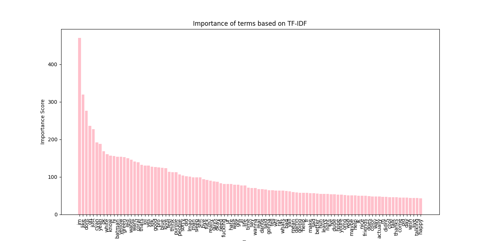

# Ventscape Most Important Terms

## What does it do?

This Python script sorts terms used in messages on VentScape in descending order of their importance and plots them on a graph.

Top 50 most important terms in a set of 20,000 messages:

Top 100 most important terms in the same set of messages:

## What is TF-IDF?

This Python project utilises Term Frequency-Inverse Document Frequency (TF-IDF), a statistical measure used to evaluate importance of a word in a document relative to a collection of documents (a corpus). It reflects how important a word is to a document. It helps to distinguish between common and unique words.

## What is the source of this data?

The data has been taken from the [ArchiveScape project](https://github.com/LoV432/ArchiveScape).